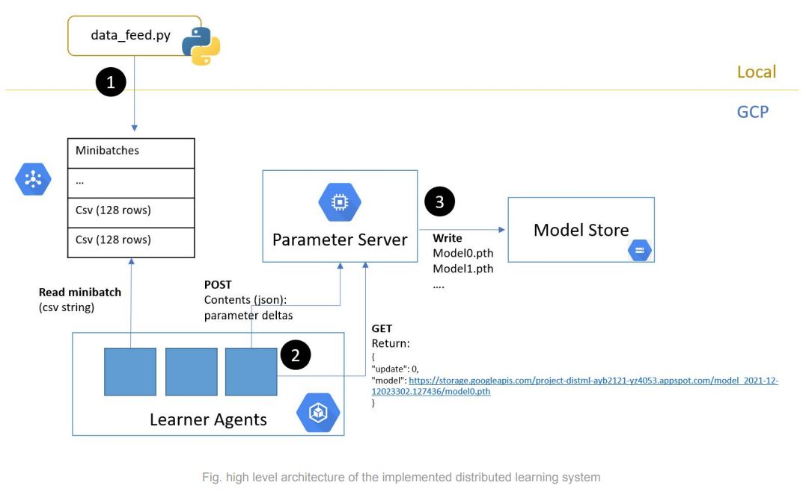
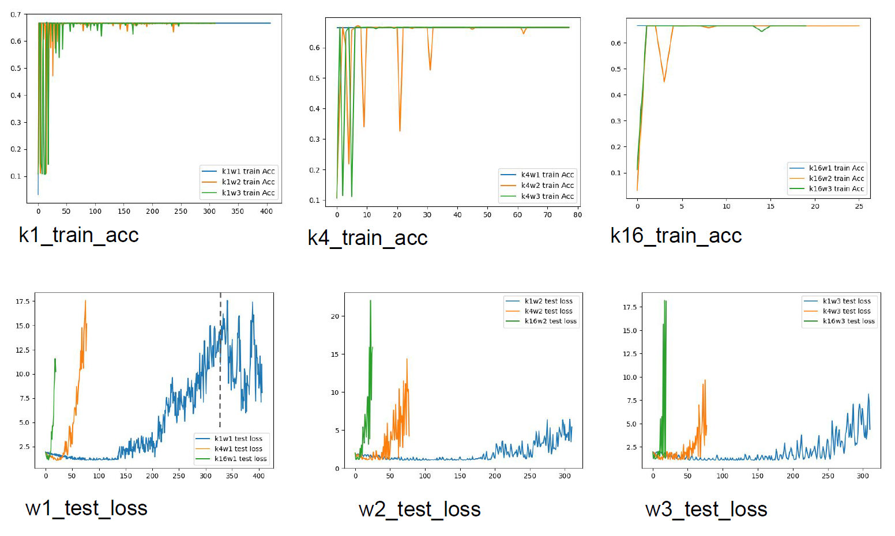
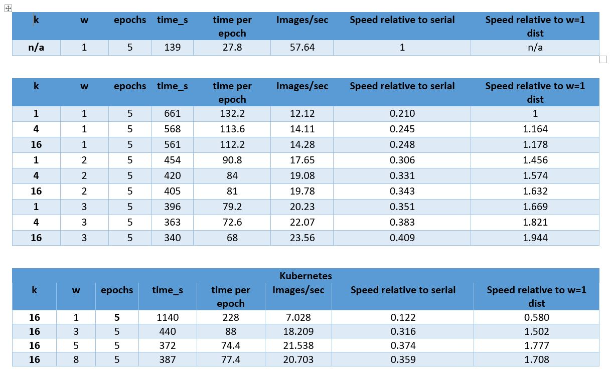

# distributed-ml-prototype
Distributed ML prototype architecture for COMES6998 project. We use CPU training for all the VMs. 



# How to run local (non-distributed) version
```
cd model
python model.py
```

Make sure the csv file is in the right directory in /data


# How to run distributed version
**Important** - for auth, you must have a service-account.json credentials file placed under /distributed. Since this file contains credentials, it is not located in this repo. To get access to this file please email ayb2121@columbia.edu. 

Files are located in the /distributed folder. There are some library depencencies needed like. 

```
pip install google-cloud-pubsub
pip install google-cloud-storage
```

There are hardcoded instances of the pubsub, storage account and http server. These will be deployed/active until 12-18-2021 and then de-allocated. 

Data is written to [google pub/sub](https://cloud.google.com/pubsub/lite/docs/quickstart#pubsublite-quickstart-publisher-python).

You will need your own instance of pub/sub if trying to run this. 

## First, data needs to be sent to a queue  
Example usage  
```
cd distributed
python data_feed.py ../data/hmnist_28_28_RGB.csv <specify epochs>
```

## Then, run the parameter server which will host a local API.
Example usage
```
python parameter_server.py
```

If running from a GCP VM, this is the command:
```
~/.local/bin/gunicorn -b :8080 parameter_server:app
```

This will set up a server on localhost if running locally. If deployed to a VM, it will set up a server accessible using the public URL of the VM. 

**To query the existing deployed parameter server (GET), go to** [http://35.236.39.83:8080/](http://35.236.39.83:8080/). Again this will be deactived on 12-18-2021. The payload you receive from going to this URL should also be downloadable, and will contain the latest model for the experiment. 

## Finally, you need to create a separate instance (while parameter_server is running) and run learner.py  
You may need to edit the main function here and replace the ps_url with your own. If you want to use the hosted parameter server, set http://35.236.39.83:8080/ as the ps_url. 

Example usage
```
python learner.py
```

There is also a temporary instance of this deployed to kubernetes. In order to give it tasks, run the distributed/data_feed.py script and wait a few minutes. Then ping the [public parameter server url](http://35.236.39.83:8080/) to see the version increase. 

# Results (Accuracy)
The plots for all models evaluation are saved in folder'images'. 


## Obervations
- The distributed training takes more time and results in a much lower accuracy compared the baseline serial model, the model convergence is slower with more compute nodes. 
- The model accuracy goes up to above ~0.6 to 0.7 then stagnate or the improvement is too small to be observed.
- Overfitting exists. For the distributed training, the loss goes down for a little bit and then gets explode. In general, loss gets bigger when the k number is bigger. 
## Possible solution to improve the performance of the system
- Use more sophisticated network architecture, use GPU and do the distributed training for more epochs. 
- Use pytorch instead of tensorflow, tensorflow might have a better performance when using CPU.


# Results (Scalability)
The timestamps.xlsx contains the compiled results from the distributed runs. The table below was generated using the data in this spreadsheet. 

The consensus is that this implmentation of the learner-ps interaction is too network and I/O intensive. The non-distributed version trains faster and converges faster. However the distributed version is somewhat scalable amongst itself (within 1-5 workers). 


